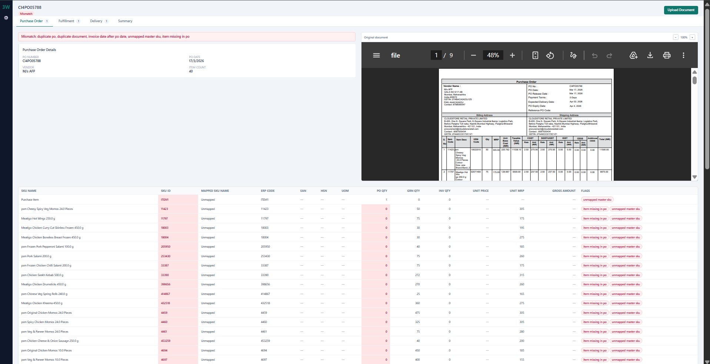
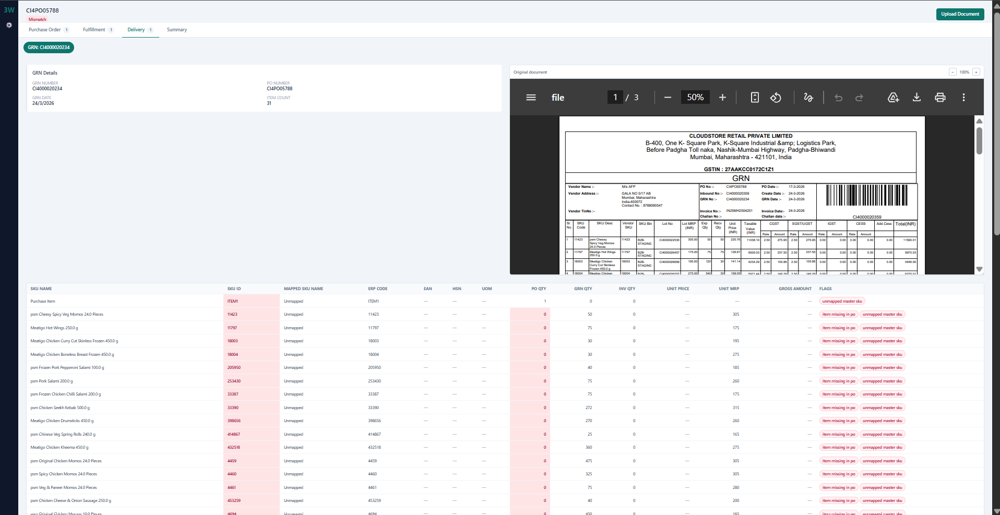
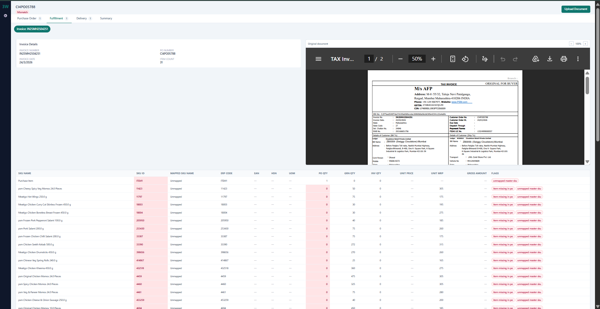
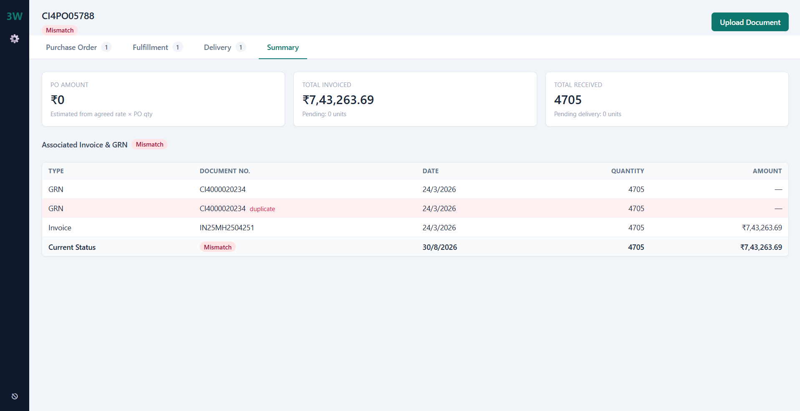

# Three-Way Match Engine — PO / GRN / Invoice

Full-stack app that ingests Purchase Order, GRN, and Invoice documents (PDF/image), extracts
structured data with the Gemini API, resolves line items against a SKU Master catalogue, and
recomputes a three-way match on every read.

## Screenshots

### Purchase Order


### Delivery / GRN


### Invoice / Fulfillment


### Summary


## Repo layout

```
backend/    Node.js + Express + MongoDB API, Gemini extraction, matching engine
frontend/   Next.js (App Router) + Tailwind + TanStack Query UI
samples/    Sample Gemini output, GET /match, GET /summary JSON
api-docs/   Postman collection
```

## Setup & run

### Backend
```bash
cd backend
cp .env.example .env      # fill in MONGO_URI, GEMINI_API_KEY, AUTH_* values
npm install
npm run dev                # nodemon, http://localhost:4000
```
Requires a running MongoDB instance (local `mongod` or a connection string, e.g. Atlas) reachable
at `MONGO_URI`.

### Frontend
```bash
cd frontend
cp .env.example .env.local   # NEXT_PUBLIC_API_BASE_URL=http://localhost:4000
npm install
npm run dev                  # http://localhost:3000
```

### Login
There's no real identity provider. `POST /auth/login` checks `AUTH_USERNAME` / `AUTH_PASSWORD`
from the backend `.env` (defaults `admin` / `admin123`) and returns the static `AUTH_TOKEN` from
`.env`. The frontend stores that token in `localStorage` and attaches it as `Authorization: Bearer
<token>` on every protected request via the `apiFetch` wrapper in `lib/api.ts`. The one exception
is the `<iframe>`/`` file-preview requests, which can't carry custom headers — those pass the
token as a `?token=` query param instead, accepted by the same `requireAuth` middleware.

## Gemini configuration

Set `GEMINI_API_KEY` and optionally `GEMINI_MODEL` (defaults to `gemini-3.6-flash`) in
`backend/.env`. `src/services/gemini.js` sends the uploaded file inline (base64) together with a
document-type-specific prompt that requests a fixed JSON shape. The response is stripped of any
markdown code fences, `JSON.parse`d, and checked against the minimum required fields for that
document type. If parsing or validation fails, the call is retried once; if the retry also fails,
the upload is rejected with a 422 and a clear error message — nothing partial or malformed is ever
persisted.

## Data model

Matches the spec's five collections (`SkuMaster`, `PurchaseOrder`, `Grn`, `Invoice`,
`MatchAudit`). A few deliberate choices:

- **`poNumber` / `grnNumber` / `invoiceNumber` are NOT unique at the DB level.** The assignment
  requires that a second PO for an existing `poNumber` (or a repeated GRN/Invoice number under the
  same PO) still be **stored**, not overwritten or rejected — only flagged. So these fields are
  indexed but not `unique`; uniqueness/duplication is enforced in application code
  (`services/duplication.js`) after persistence, which sets `isDuplicate` / `duplicateReason` on
  the document. The match engine treats duplicates as a hard violation (`duplicate_po` /
  `duplicate_document`) but excludes their quantities from aggregation so a re-upload doesn't
  silently double-count received/invoiced quantities.
- **`rawParsed`** stores the raw Gemini text response (not just the parsed JSON) so extraction bugs
  can be debugged without re-uploading and re-billing the API call.
- ERP and EAN codes are stored as `String`, never `Number`, per the spec (leading zeros, alphanumeric
  codes, etc. would otherwise be silently corrupted).

## Parsing → resolution → duplication → persistence flow

`documentsController.uploadDocument` runs the pipeline as plain sequential function calls (per the
assignment's guidance — no engine/plugin abstraction for a 5–6 day build):

1. **Parse** — `extractDocument(documentType, filePath, mimeType)` calls Gemini, validates shape,
   retries once. Failure here returns 422 and nothing is stored.
2. **Master resolution** — `resolveItemsAgainstMaster(items)` mutates each item in place, looking
   up `SkuMaster` by `skuErpCode` (trimmed/case-insensitive) first, then `eanCode`. Unresolved items
   are **never dropped** — they're kept with `skuMaster: null` and `unmappedMasterSku: true`, and
   the match engine reports them as `unmapped_master_sku` (soft warning, not a blocker).
3. **Persist** — the document is saved regardless of whether a PO already exists for that
   `poNumber` (out-of-order uploads are first-class, not an edge case) and regardless of resolution
   warnings.
4. **Duplication check** — runs *after* persistence, since the point is to detect and flag an
   existing record, not to gate the save.
5. Every step writes an entry to `MatchAudit` (one document per `poNumber`, appended to on every
   upload event) so the pipeline's history is inspectable via the `MatchAudit` collection.

## Item matching key & out-of-order handling

Every PO/GRN/Invoice line is keyed for matching purposes by **`SkuMaster._id`** when resolved,
falling back to the **normalised raw `itemCode`** when it isn't (see `matchEngine.js:itemKey`).
This is what lets `BIK-BIKANERI-200G` on a PO line and `Bikaji Bikaneri Bhujia 200 G Pp` on the
matching GRN line be recognised as the same physical product — matching on description text would
be fragile since vendors format free-text differently per document; matching on the resolved
master record is what the assignment calls out as the crux of the exercise.

Because `Grn.poNumber` and `Invoice.poNumber` are plain link-key strings (no foreign key /
`ref` to an existing `PurchaseOrder` document), a GRN or Invoice can be uploaded and stored before
its PO exists. `GET /match/:poNumber` and `GET /summary/:poNumber` never read a cached result —
they call `computeMatch`/`computeSummary`, which re-query all three collections by `poNumber` from
scratch on every request. If the PO arrives later, the very next `GET /match` call picks it up
automatically with no reprocessing step needed. The same applies if a missing `SkuMaster` record is
added after the fact — resolution isn't re-run retroactively on stored documents, but since
`itemKey` falls back to the raw code either way, and the match reads `SkuMaster` fresh on every
compute, a newly-added master will attach its `agreedRate`/`mrp` to future match reads for any item
whose raw code coincidentally already matches a resolved key... *except* the stored item's
`skuMaster` field itself stays `null` until that document is re-parsed. This is a known limitation —
see below.

## Matching logic

`services/matchEngine.js` computes bottom-up:

1. Aggregate PO qty, GRN received qty, and Invoice qty **per item key**, summing across multiple
   lines/documents of the same type (e.g. two GRNs against one PO).
2. For each item, evaluate the reason codes from the spec table (`grn_qty_exceeds_po_qty`,
   `invoice_qty_exceeds_grn_qty`, `invoice_qty_exceeds_po_qty`, `item_missing_in_po`,
   `price_mismatch`, `mrp_mismatch`, `unmapped_master_sku`). Missing rate/MRP values never produce a
   mismatch by themselves, and a zero/invalid `agreedRate` is guarded against before dividing.
3. Roll up to PO level: `duplicate_po`, `duplicate_document`, and `invoice_date_after_po_date` are
   evaluated once at the PO level; every item-level reason bubbles up into the PO's deduped
   `reasons` array.
4. **Status precedence** (first match wins):
   - `insufficient_documents` — if the PO, or *any* GRN, or *any* Invoice is entirely absent for
     this `poNumber`. Missing document types are never treated as zero quantity, since that would
     wrongly report `grn_qty_exceeds_po_qty`-style violations before there's anything to compare.
   - `mismatch` — any hard violation (`*_qty_exceeds_*`, `invoice_date_after_po_date`,
     `duplicate_po`, `duplicate_document`, `item_missing_in_po`) present anywhere.
   - `partially_matched` — no hard violations, but either a soft warning exists
     (`price_mismatch`/`mrp_mismatch`/`unmapped_master_sku`) or quantities aren't yet fully
     reconciled (e.g. a partial delivery where `grnQty < poQty`, which is normal mid-flow and *not*
     a violation).
   - `matched` — `poQty === grnQty === invoiceQty` for every item and zero reasons anywhere.

## Duplicate handling

- A second **PO** upload for a `poNumber` that already has one: stored as its own document, flagged
  `isDuplicate: true` / `duplicateReason: 'duplicate_po'`. The match engine always treats the
  *first-created* PO as canonical for item comparisons and surfaces `duplicate_po` as a hard
  violation so the conflict can't be silently ignored.
- A second **GRN/Invoice** reusing a `grnNumber`/`invoiceNumber` under the same `poNumber`: stored
  and flagged `duplicate_document`; its quantities are excluded from aggregation (so re-uploading
  the same delivery note twice doesn't double the received quantity), but the flag itself still
  forces the PO into `mismatch` until resolved.

## Frontend architecture & state management

**TanStack Query** was chosen over Redux Toolkit. Almost everything the UI shows (documents, match
result, summary, SKU masters) is server state that's cheap to refetch and must never go stale —
`GET /match` explicitly recomputes on every call, so caching it client-side beyond a short
`staleTime` would work against that guarantee. TanStack Query gives cache invalidation
(`invalidateQueries` after every upload/CRUD mutation), request de-duplication, and loading/error
states for free, without hand-rolling reducers for data that has no real client-side transformation
logic. The small amount of genuine UI-only state (active tab, active GRN/Invoice sub-tab, modal
open/closed) lives in plain `useState` in the page components — it's local and short-lived enough
that a global store would be overkill.

`lib/api.ts` is the fetch wrapper: it attaches the bearer token from `localStorage`, throws a typed
`ApiError` on non-2xx responses, and is the single place all requests flow through. `lib/queries.ts`
wraps each endpoint in a typed function used by the TanStack Query hooks in the page components.
`lib/useAuthGuard.ts` redirects to `/login` client-side if no token is present.

## API summary

See `api-docs/postman_collection.json` for a runnable collection. All routes except `POST
/auth/login` require `Authorization: Bearer <token>`.

| Method | Path | Purpose |
|---|---|---|
| POST | `/auth/login` | Returns the static bearer token |
| POST | `/documents/upload` | multipart upload (`file`, `documentType`) — runs the full pipeline |
| GET | `/documents/:id` | One document, SKU master populated |
| GET | `/documents/:id/file` | Original file bytes for preview |
| GET | `/documents?type=&poNumber=` | List/filter documents |
| GET | `/match/:poNumber` | Recomputed match result |
| GET | `/summary/:poNumber` | Summary tab data |
| GET/POST/PATCH/DELETE | `/masters/sku[/:id]` | SKU Master CRUD |

## Assumptions & tradeoffs

- Local disk storage for uploaded files (`backend/uploads/`), no cloud blob storage — per the
  assignment's stated assumptions.
- The minimum required PO fields (per the spec) don't include a unit price, so the **PO Amount**
  stat card on the Summary tab is *estimated* as `Σ (poQty × SkuMaster.agreedRate)` per resolved
  item rather than read directly off the PO document. This is called out inline in the UI and in
  `summaryEngine.js`.
- `invoiceUnitRate`/`invoiceMrp`/`grnMrp` aggregation across **multiple** GRNs/Invoices for the same
  item takes the last non-null value seen (documents are processed in `createdAt` order), rather
  than an average — simplest reasonable behaviour for a 5–6 day scope; flagged as an area to revisit
  if genuinely variable pricing across partial deliveries becomes common.
- UOM conversion is explicitly out of scope, matching the spec.
- Master resolution runs once at upload time, not retroactively. If a `SkuMaster` record is created
  *after* a document was uploaded with an unresolvable code, that stored item stays
  `unmappedMasterSku: true` until the document is re-uploaded/re-parsed. A follow-up worth adding: a
  "re-resolve" endpoint that re-runs resolution against currently-stored raw items without requiring
  re-upload.
- Auth is intentionally minimal (single static token) per the assignment's explicit allowance.

## Known limitations / what I'd improve next

- No automated tests were included given the timeline; the highest-value additions would be unit
  tests for `matchEngine.js` (it's pure and easy to test in isolation) and an integration test for
  the upload → resolve → duplicate-check → match pipeline.
- No pagination on `/documents` or `/masters/sku` list endpoints — fine at assignment scale, would
  need cursor/offset pagination for a real catalogue.
- The retroactive-master-resolution gap noted above.
- Visual fidelity to the reference screenshots is close but not pixel-identical (bonus item, not
  attempted beyond the core layout/tabs/banners/highlighting).

## AI tools used

This implementation (backend, frontend, and this README) was built with Claude (Anthropic) as a
pair-programming/code-generation assistant across the full stack, plus the Gemini API as the
in-product document-extraction engine the assignment specifies.
